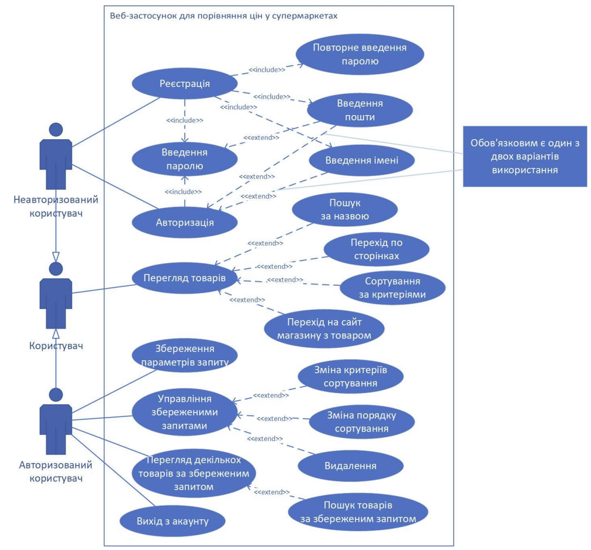
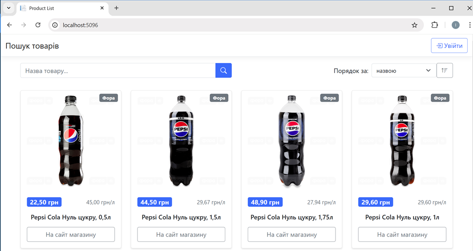
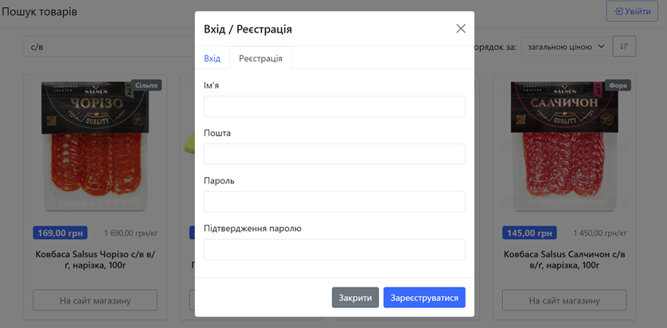
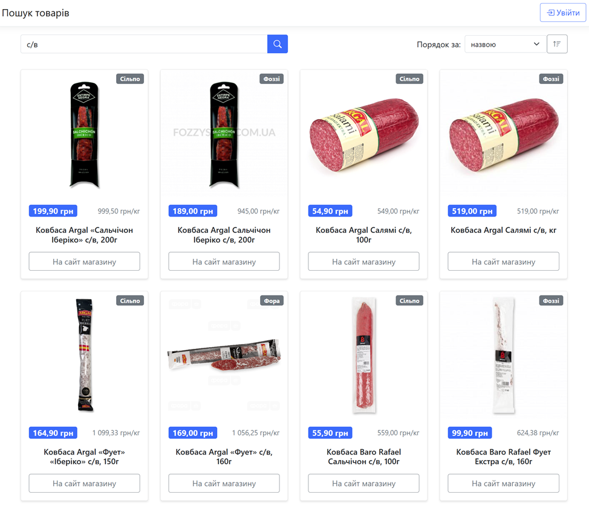
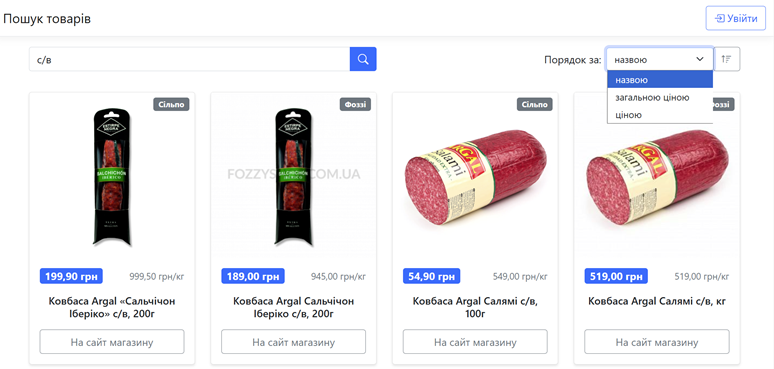
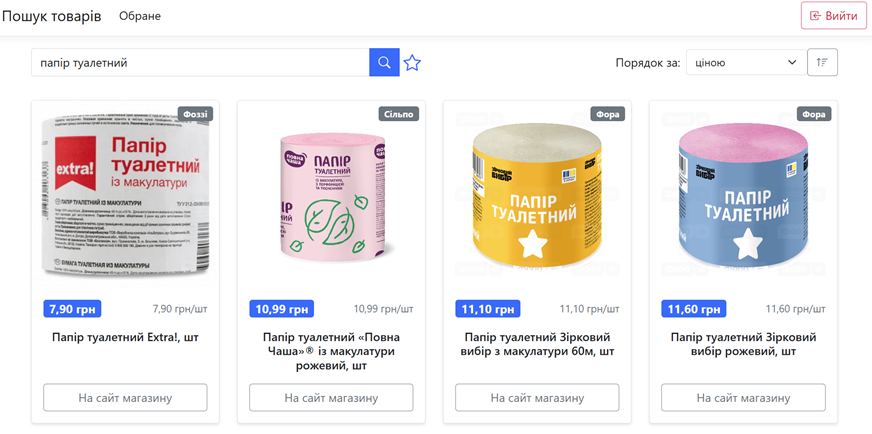
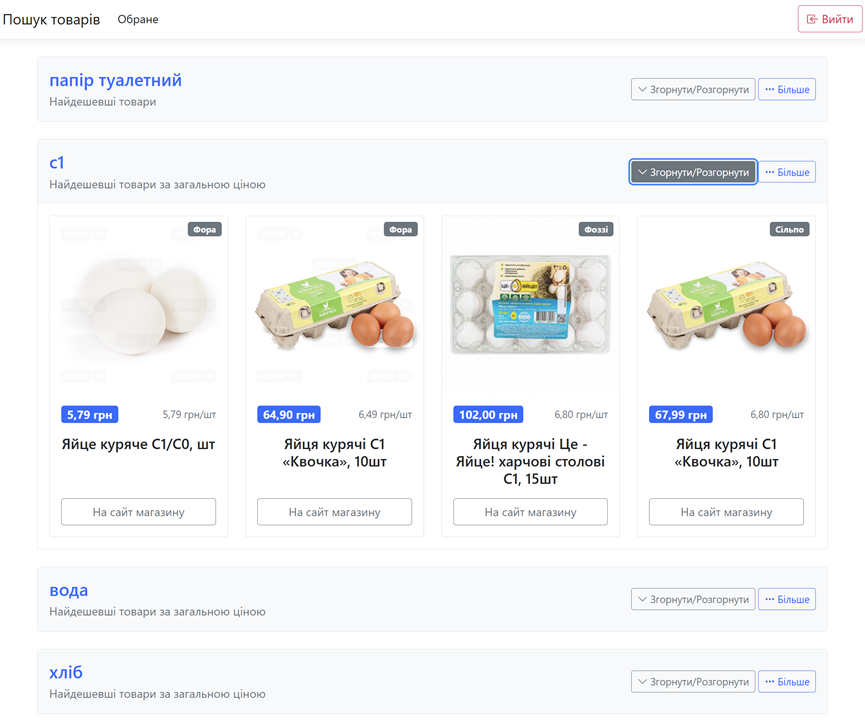

# Requirements for identifying same product:
- have same names (to lowercase, ~90% trigram), same measure dimension
- multiple measures per one name (pepsi 1.25, 0.75)
- per measure:
    - multiple shops, per shop:
        - price
        - image/product link
        - prices history

# Product page
- name
- details:
    - choose from:
        - shop: silpo, fora, fozzy (greyed out if no product in the shop)
        - measure: e.g. 1.5 L, 750 ml (no options to choose from if it is single measure)
    - chose influence price, link image, link product
- graph:
    - mode history per actual measure:
        - display unique measures from the list, allow to pick one
        - 1 to 3 different colored lines - price history per shop (not all shops might have the product with given measure)
    - mode unified price history per (shop, measure) pair:
        - 1 to 3 different line colors (per shop)
        - k different tones of one color (per different measures of one shop)
        - price is unified and shown on the graph
    - one graph line uniquely identifies product, so when it is clicked - appropriately change product details
- similar products (ranked from most similar by name to least, 10 items)

# Веб-застосунок для моніторингу цін у супермаркетах

Цей застосунок дозволяє користувачам знаходити товари у різних супермаркетах, порівнювати їхні ціни, зберігати пошукові запити та швидко повертатися до них у майбутньому. Доступні функції як для неавторизованих користувачів (пошук, перегляд), так і для авторизованих (збереження та управління запитами).

## Діаграма варіантів використання

Нижче наведена діаграма, яка відображає всі основні сценарії взаємодії користувача із системою:

## Інтерфейс
Головна сторінка:

Модальне вікно для реєстрації нового користувача:  

Результат пошуку серед товарів:  

Опції для впорядкування продуктів:  

Сторінка пошуку для авторизованого користувача:  

Збережений запит користувачем:  

Сторінка обраних запитів:  

