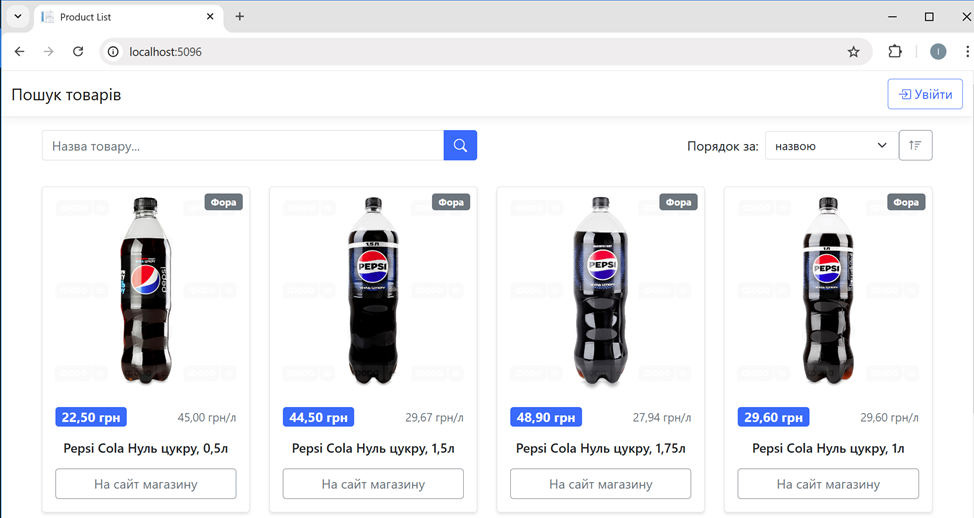
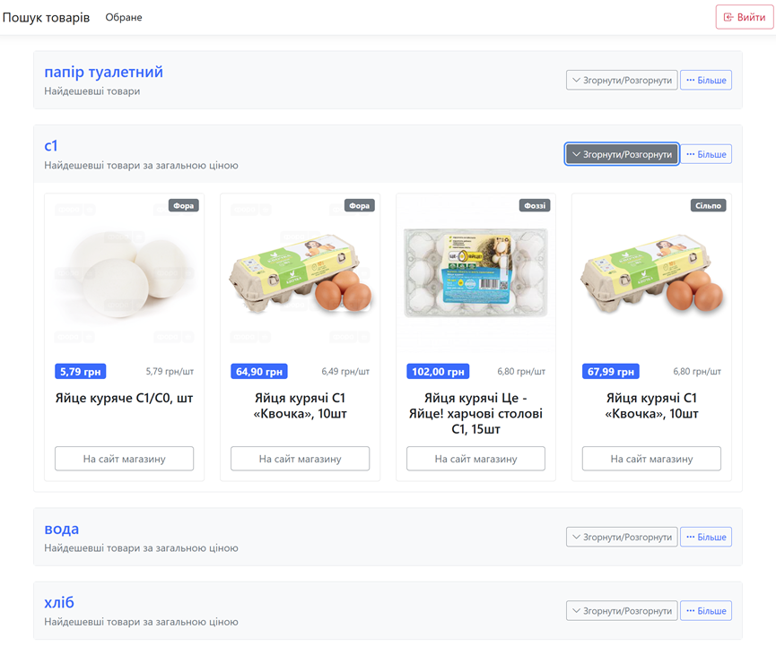

# Веб-застосунок для моніторингу цін у супермаркетах

Цей застосунок дозволяє користувачам знаходити товари у різних супермаркетах, порівнювати їхні ціни, зберігати пошукові запити та швидко повертатися до них у майбутньому. Доступні функції як для неавторизованих користувачів (пошук, перегляд), так і для авторизованих (збереження та управління запитами).

## Діаграма варіантів використання

Нижче наведена діаграма, яка відображає всі основні сценарії взаємодії користувача із системою:

## Інтерфейс
Головна сторінка:

Модальне вікно для реєстрації нового користувача:  

Результат пошуку серед товарів:  

Опції для впорядкування продуктів:  

Сторінка пошуку для авторизованого користувача:  

Збережений запит користувачем:  

Сторінка обраних запитів:  

